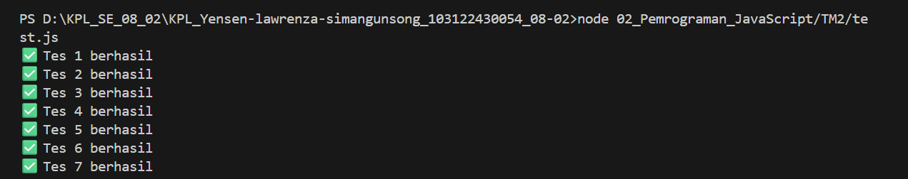

TM 02_Pemrograman JavaScript

1.DESKRIPSI TUGAS       

-"Fizz" jika bilangan merupakan kelipatan 2

-"Buzz" jika bilangan merupakan kelipatan 7

-"FizzBuzz" jika bilangan merupakan kelipatan 14

-Jika bukan kelipatan maka menampilkan angka tersebut

Jika input bukan array maka menaampilkan Input tidak valid

2.KODE PROGRAM

function fizzBuzz(data) {

    if (Array.isArray(data) === false) {
        return "Input tidak valid";
    }

    let hasil = [];
    let adaFizzBuzz = false;
    let adaNegatif = false;

    for (let i = 0; i < data.length; i++) {

        let angka = data[i];

        if (angka < 0) {
            adaNegatif = true;
        }

        if (angka % 14 === 0) {
            hasil.push("FizzBuzz");
            adaFizzBuzz = true;
        } 
        else if (angka % 2 === 0) {
            hasil.push("Fizz");
        } 
        else if (angka % 7 === 0) {
            hasil.push("Buzz");
        } 
        else {
            hasil.push(angka);
        }
    }

    let pemisah;

    if (adaFizzBuzz && !adaNegatif) {
        pemisah = " ";
    } else {
        pemisah = ", ";
    }

    return hasil.join(pemisah);
}

module.exports = fizzBuzz;

3.HASIL PENGUJIAN

4.KESIMPULAN

Fungsi FizzBuzz berhasil dibuuat sesuai dengan ketentuan soal.Program mampu mengecek kelipatan angka dalam array dan menghasilkan output yang benar serta berhasil melewati seluruh pengujian pada file test.js.