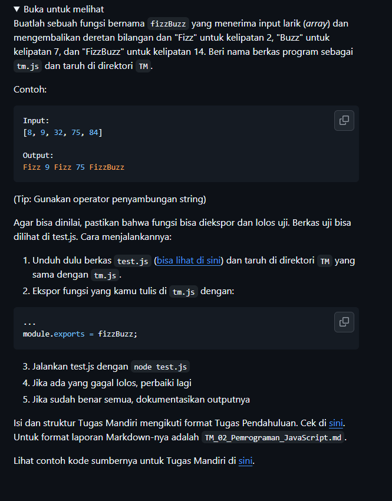
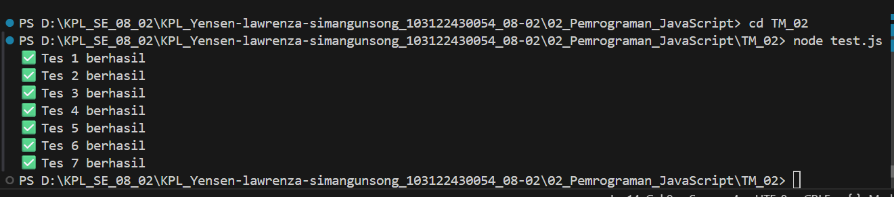

# Tugas Mandiri : Pemrograman_JavaScript

NAMA : Yensen Lawrenza Simangunsong

NIM  : 103122430054

Kelas: SE-08-02

## Soal

# Program kode 
Tersedia di [test.js](../TM_02/test.js)

# Output

# Deskripsi
-"Fizz" jika bilangan merupakan kelipatan 2.

-"Buzz" jika bilangan merupakan kelipatan 7.

-"FizzBuzz" jika bilangan merupakan kelipatan 14.

-Jika bukan kelipatan maka menampilkan angka tersebut.

-Jika input bukan array maka menaampilkan Input tidak valid

Fungsi FizzBuzz berhasil dibuuat sesuai dengan ketentuan soal.Program mampu mengecek kelipatan angka dalam array dan menghasilkan output yang benar serta berhasil melewati seluruh pengujian pada file test.js.