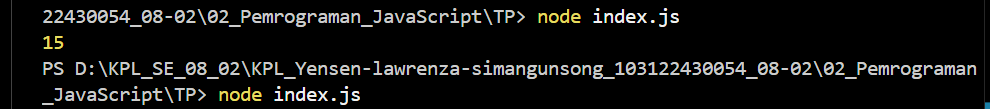
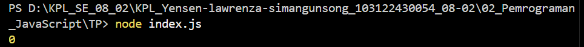
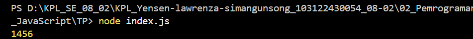
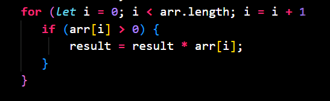

# Tugas Pendahuluan 02: Pemrograman JavaScript
**Soal**

Kamu sudah menulis fungsi mulOfArray. Ujilah dengan input [2, 0, 26, 28, -2], dengan output yang seharusnya adalah 1456. Jika kamu menemukan bahwa hasilnya berbeda, bisakah kamu memperbaikinya? Jika kamu menemukan bahwa hasilnya sama, bisakah kamu menjelaskan mengapa demikian?

**Kode sumber**

Tersedia di [index.js](./index.js)

**Output**
input awalnya : (1, -2, 3, -4, 5 -6)

input soal (2, 0, 26, 28, -2)

input hasil benar

**Deskripsi Program**

Program ini menjalankan perkalian semua bilangan positif dalam larik (_array_). Ini akan bekerja untuk bilangan positif, nol, dan negatif.

di dalam modul, contoh soal yang pertama input yang di berikan adalah (1, -2, 3, -4, 5, -6) yang artinya hanya mengalikan bilangan positif yaitu `1*3*5` yang hasilnya 15

lalu jika input nya di ubah menjadi (2, 0, 26, 28, -2) yang hasilnya 0

Nah, kenapa hasilnya 0? karena, pada operasi dasar dalam code menggunakan >= 0 
jadi, agar hasil hitungan nya benar, saya mengubahnya menjadi >0 sehingga 0 tidak ikut terhitung.
Hasilnya menjadi `2*26*28` = 1456.