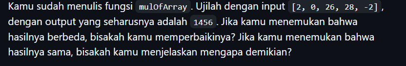

# Tugas Pendahuluan : Pemrograman_JavaScript

NAMA : Yensen Lawrenza Simangunsong

NIM  : 103122430054

Kelas: SE-08-02

## Soal

# Program kode 
Tersedia di [index.js](../02_Pemrograman_JavaScript/TP_02/index.js)

# Output

ini adalah hasil yang input awalnya : (1, -2, -4, 5, -6)

ini hasil jika input soal (2, 0, 26, 28, -2)

dan ini hasil yang benar

# Deskripsi
 

Program ini menjalankan perkalian semua bilangan positif dalam larik (array). Ini akan bekerja untuk bilangan positif,nol, dan negatif.di dalam modul contoh soal yang pertama input yang di berikan adalah (1, -2, 3, -4, 5, -6) yang artinya hanya mengalikan bilangan positif yaitu 1contoh soal yang pertama input yang di berikan adalah (1, -2, 3, -4, 5, -6) yang artinya hanya mengalikan bilangan positif yaitu 1*3*5 yang hasilnya 15. lalu jika input nya di ubah menjadi (2, 0, 26, 28, -2) yang hasilnya 0

Nah, kenapa hasilnya 0? karena, pada operasi dasar dalam code menggunakan >= 0 jadi, agar hasil hitungan nya benar, saya mengubahnya menjadi >0 sehingga 0 tidak ikut terhitung. Hasilnya menjadi 2*26*28 = 1456.*3*5 yang hasilnya 15
lalu jika input nya di ubah menjadi (2, 0, 26, 28, -2) yang hasilnya 0. Nah, kenapa hasilnya 0? karena, pada operasi dasar dalam code menggunakan >= 0 jadi, agar hasil hitungan nya benar, saya mengubahnya menjadi >0 sehingga 0 tidak ikut terhitung. Hasilnya menjadi 2*26*28 = 1456.