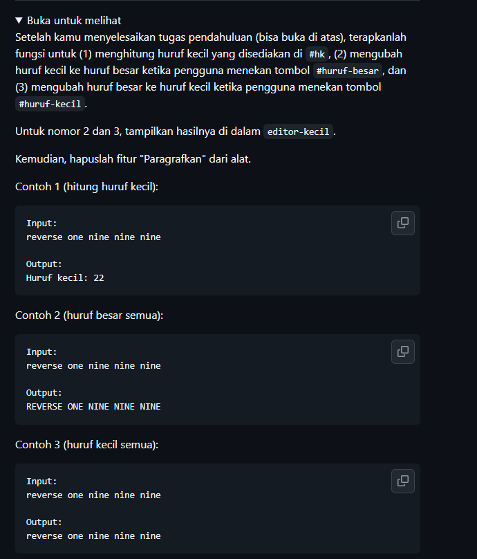
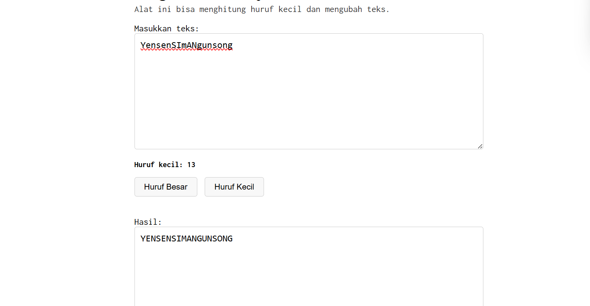
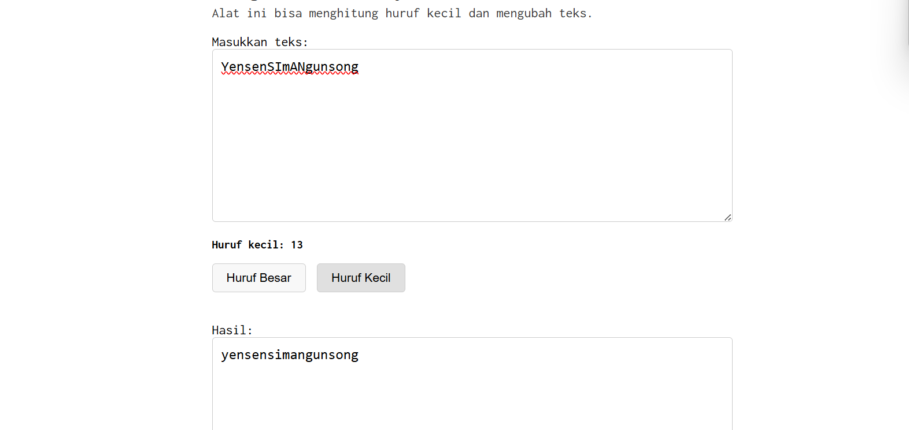

# Tugas Mandiri : GUI dengan HTML dan CSS

NAMA : Yensen Lawrenza Simangunsong

NIM  : 103122430054

Kelas  : SE-08-02

## Soal

# Program kode 
Tersedia di [index.css](../TM_03/index.css)
Tersedia di [index.html](../TM_03/index.html)
Tersedia di [index.js](../TM_03/index.js)

# Output

# Deskripsi
Proyek ini adalah sebuah aplikasi web Pengkonversi Gaya Teks yang dirancang untuk memanipulasi string secara instan dengan antarmuka pengguna yang responsif. Secara teknis, aplikasi ini mengintegrasikan HTML5 sebagai kerangka utama, CSS3 dengan metode Flexbox untuk memastikan tata letak elemen tetap presisi di tengah layar, serta JavaScript sebagai mesin pemroses logika. Fitur utamanya mencakup penghitung jumlah huruf kecil secara otomatis menggunakan Regular Expression (regex) yang bekerja secara real-time saat teks diinput. Selain itu, pengguna dapat melakukan transformasi teks menjadi format huruf besar (uppercase) atau huruf kecil (lowercase) melalui tombol interaktif. Penggunaan font Inconsolata memberikan kesan teknis yang bersih, sementara struktur kodenya yang modular memastikan aplikasi ini ringan dan mudah untuk dikembangkan lebih lanjut.