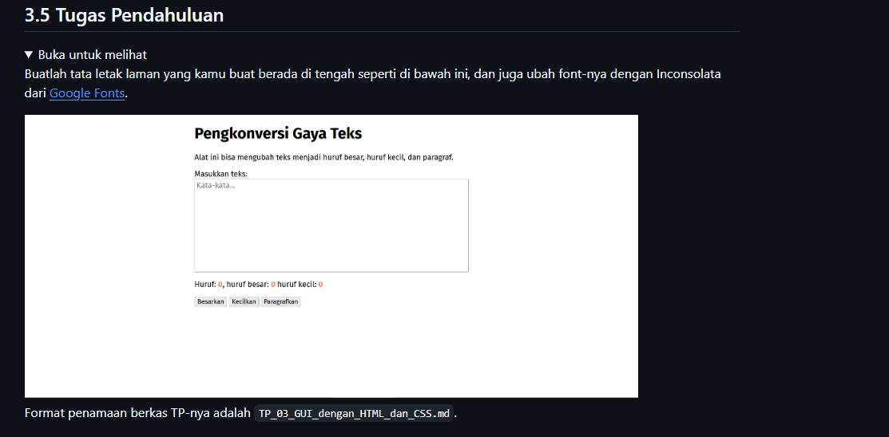
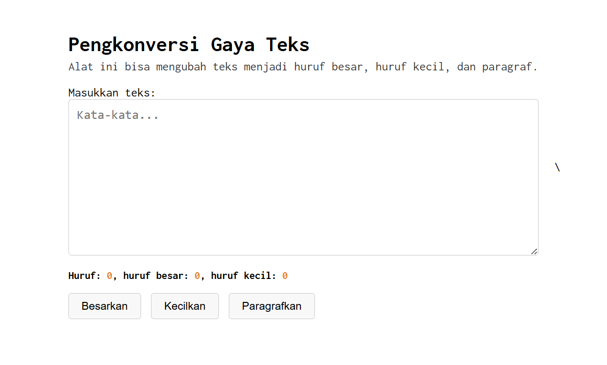

# Tugas Mandiri : Pemrograman_JavaScript

NAMA : Yensen Lawrenza Simangunsong

NIM  : 103122430054

Kelas: SE-08-02

## Soal

# Program kode 
Tersedia di [index.css](../TP_03/index.css)
Tersedia di [index.html](../TP_03/index.html)
Tersedia di [index.js](../TP_03/index.js)

# Output

# Deskripsi

1.Deskripsi index.html

Berkas index.html berisi struktur utama aplikasi Pengkonversi Gaya Teks. Di dalamnya terdapat textarea tempant pengguna tempat pengguna memasukkan teks, beberap untuk menampilkan statistik teks seperti jumlah karakter, huruf besar, dan huruf kecil, serta tiga tombol yang berfungsi untuk mengubah teks menjadi huruf besar, huruf kecil, atau format paragraf (sentence case). HTML ini juga memuat link ke file CSS (index.css) untuk styling dan file JavaScript (index.js) untuk logika transformasi teks dan perhitungan statistik secara real-time.

2.Deskripsi index.js

Berkas index.js berisi logika interaktif aplikasi. Script ini menangkap event input dari textarea untuk menghitung jumlah karakter, huruf besar, dan huruf kecil setiap kali pengguna mengetik. Fungsi transform(type) digunakan untuk mengubah teks berdasarkan pilihan tombol: jika type adalah "upper", teks diubah menjadi huruf besar; jika "lower", teks menjadi huruf kecil; dan jika "sentence", teks diubah menjadi format paragraf dengan huruf pertama setiap kalimat kapital. JavaScript ini memastikan aplikasi bisa merespons perubahan teks secara dinamis.

3.Deskripsi index.css

Berkas index.css berisi aturan tampilan (styling) aplikasi. Body menggunakan font Inconsolata dan memposisikan kontainer di tengah layar. Kontainer dibatasi maksimal 600px agar tampilan lebih rapi, sedangkan tekstarea diberikan ukuran lebar penuh, tinggi 200px, dan bisa di-resize vertikal. Statistik teks diberi warna oranye agar mudah terlihat, dan tombol diberikan padding, border radius, serta efek hover untuk meningkatkan pengalaman pengguna. CSS ini membuat aplikasi terlihat bersih, responsif, dan mudah digunakan.