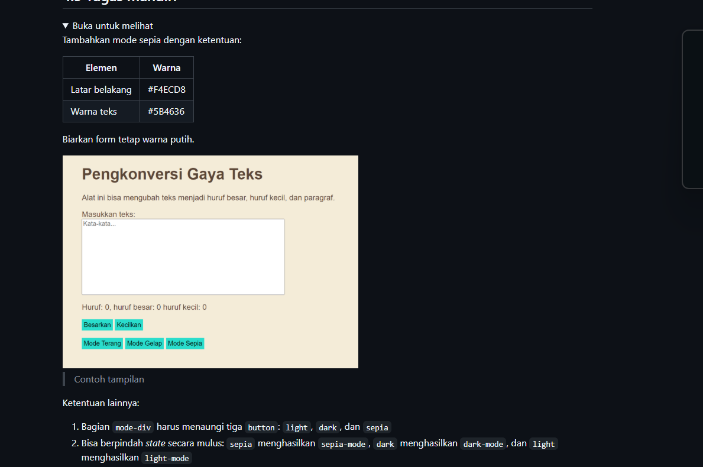
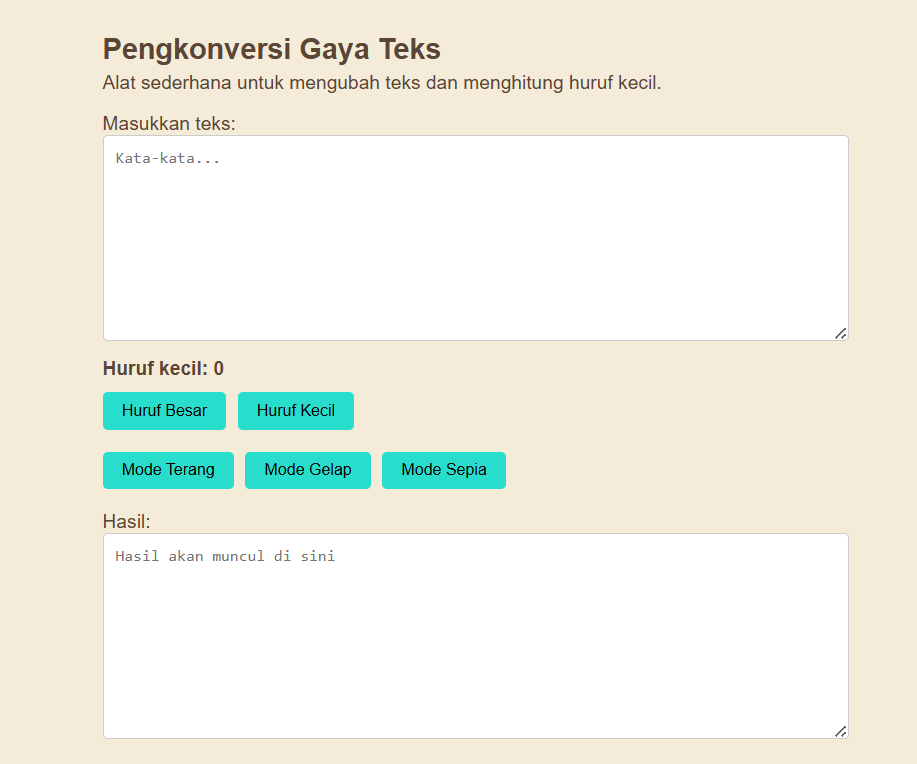

# Tugas Mandiri : Automata dan Table-Driven Construction

NAMA : Yensen Lawrenza Simangunsong

NIM  : 103122430054

Kelas: SE-08-02

## Soal

# Program kode 
Tersedia di [inndex.html](../TM_04/index.html)
Tersedia di [index.css](../TM_04/index.css)
Tersedia di [index.js](../TM_04/index.js)

# Output

# Deskripsi

Penambahan fitur pada program ini dibuat supaya tampilan aplikasi jadi lebih nyaman dan tidak monoton. Awalnya hanya ada mode terang dan gelap, lalu ditambahkan satu lagi yaitu mode sepia. Mode sepia ini memberikan tampilan warna seperti kertas lama, dengan background agak coklat muda dan teks yang lebih gelap, jadi lebih enak dilihat dalam waktu lama.

Di bagian HTML, yang ditambahkan hanya satu tombol yaitu “Mode Sepia” supaya pengguna bisa memilih tampilan tersebut. Lalu di CSS, ditambahkan pengaturan warna khusus untuk sepia, seperti background #F4ECD8 dan warna teks #5B4636. Meskipun tampilannya berubah, bagian textarea tetap dibuat putih supaya tulisan tetap jelas dan mudah dibaca.

Di bagian JavaScript, ditambahkan fungsi untuk mengaktifkan mode sepia. Cara kerjanya cukup sederhana, yaitu menghapus mode lain yang sedang aktif lalu menggantinya dengan mode sepia. Selain itu, sedikit penyesuaian juga dilakukan pada mode terang dan gelap supaya saat berpindah mode tidak saling bentrok.

Dengan penambahan ini, aplikasi jadi punya tiga pilihan tampilan yaitu terang, gelap, dan sepia. Pengguna bisa bebas memilih sesuai kenyamanan mereka, dan tampilan aplikasi juga jadi lebih menarik seperti yang diinginkan.