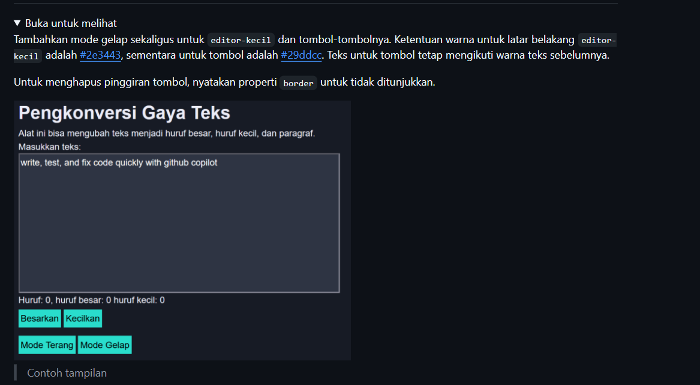
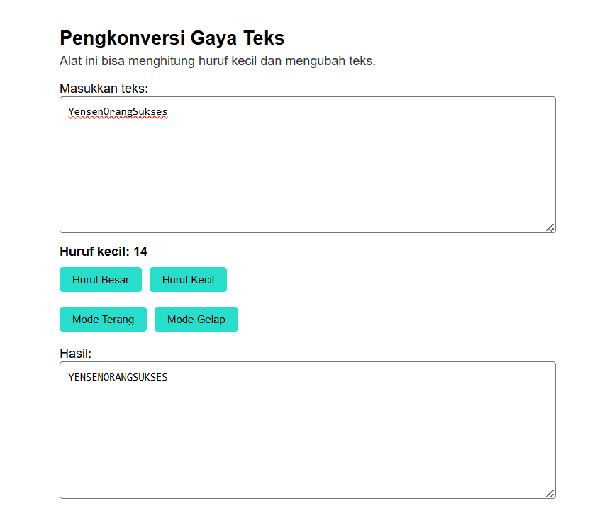
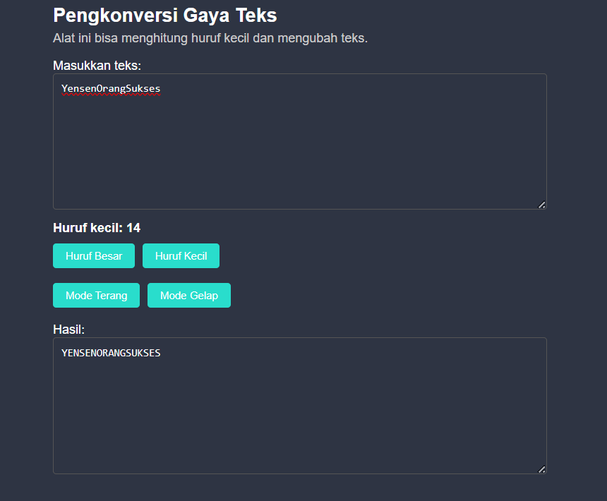

# Tugas Pendahuluam : Automata dan Table-Driven Construction

NAMA : Yensen Lawrenza Simangunsong

NIM  : 103122430054

Kelas: SE-08-02

## Soal

# Program kode 
Tersedia di [index.css](../TP_04/index.css)
Tersedia di [index.html](../TP_04/index.html)
Tersedia di [index.js](../TP_04/index.js)

# Output

### a. Mode Terang (Light Mode)
Pada mode terang, tampilan program menggunakan latar belakang berwarna putih dengan teks berwarna gelap. Area input dan output terlihat jelas dengan border tipis berwarna abu-abu. Tombol-tombol memiliki warna biru tosca (#29ddcc) sehingga tetap menonjol dan mudah digunakan.

### b. Mode Gelap (Dark Mode)
Pada mode gelap, tampilan program berubah menjadi latar belakang gelap dengan warna #2e3443. Warna teks berubah menjadi putih agar tetap terbaca dengan jelas. Area textarea juga menyesuaikan dengan warna gelap sehingga terlihat konsisten.
Tombol tetap menggunakan warna biru tosca (#29ddcc) agar kontras dengan latar belakang gelap. Mode ini memberikan kenyamanan bagi pengguna saat digunakan dalam kondisi minim cahaya serta mengurangi kelelahan mata.

# Deskripsi

Program ini merupakan aplikasi sederhana berbasis web yang digunakan untuk mengubah teks menjadi huruf besar dan huruf kecil, menghitung jumlah huruf kecil dalam teks, serta menyediakan fitur tambahan berupa mode gelap (dark mode) untuk meningkatkan kenyamanan pengguna saat menggunakan aplikasi.

### Fitur Program
a. Konversi Teks

Program ini menyediakan dua tombol utama yaitu tombol “Huruf Besar” yang berfungsi untuk mengubah seluruh teks menjadi huruf kapital (uppercase), serta tombol “Huruf Kecil” yang berfungsi untuk mengubah teks menjadi huruf kecil (lowercase).

b. Perhitungan Huruf

Program mampu menghitung jumlah huruf kecil dari teks yang dimasukkan oleh pengguna. Hasil perhitungan ini akan ditampilkan secara langsung pada bagian informasi sehingga pengguna dapat mengetahui jumlah huruf kecil dalam teks tersebut.

c. Mode Gelap (Dark Mode)

Program dilengkapi dengan fitur mode gelap di mana tampilan latar belakang akan berubah menjadi warna gelap (#2e3443), warna teks menjadi putih agar tetap terbaca, dan tombol tetap menggunakan warna biru tosca (#29ddcc) sehingga tetap kontras dan mudah digunakan.

### Implementasi
a. HTML

HTML digunakan untuk membangun struktur utama halaman web, seperti area input teks, tombol aksi untuk mengubah teks, serta area output untuk menampilkan hasil perubahan teks.

b. CSS

CSS digunakan untuk mengatur tampilan program, seperti menghilangkan border pada tombol, memberikan warna tombol sesuai ketentuan yaitu #29ddcc, serta mengatur tampilan mode gelap menggunakan class .dark-mode.

c. JavaScript

JavaScript digunakan untuk mengatur logika program, seperti mengubah teks menjadi huruf besar atau kecil, menghitung jumlah huruf kecil menggunakan perulangan, serta mengaktifkan dan menonaktifkan mode gelap dengan memanfaatkan classList.

### Cara Kerja Program

Program bekerja dengan cara pengguna memasukkan teks ke dalam textarea yang tersedia, kemudian pengguna dapat menekan tombol “Huruf Besar” untuk mengubah teks menjadi huruf kapital atau tombol “Huruf Kecil” untuk mengubah teks menjadi huruf kecil. Setelah itu, program akan menghitung jumlah huruf kecil dalam teks tersebut dan menampilkannya. Selain itu, pengguna juga dapat mengaktifkan mode gelap atau mode terang menggunakan tombol yang tersedia.

### Kesimpulan

Program ini berhasil mengimplementasikan konsep manipulasi string menggunakan JavaScript, penggunaan DOM untuk mengakses dan mengubah elemen HTML, serta styling menggunakan CSS. Selain itu, program juga dilengkapi dengan fitur tambahan berupa mode gelap yang sesuai dengan instruksi soal dan meningkatkan kenyamanan pengguna.