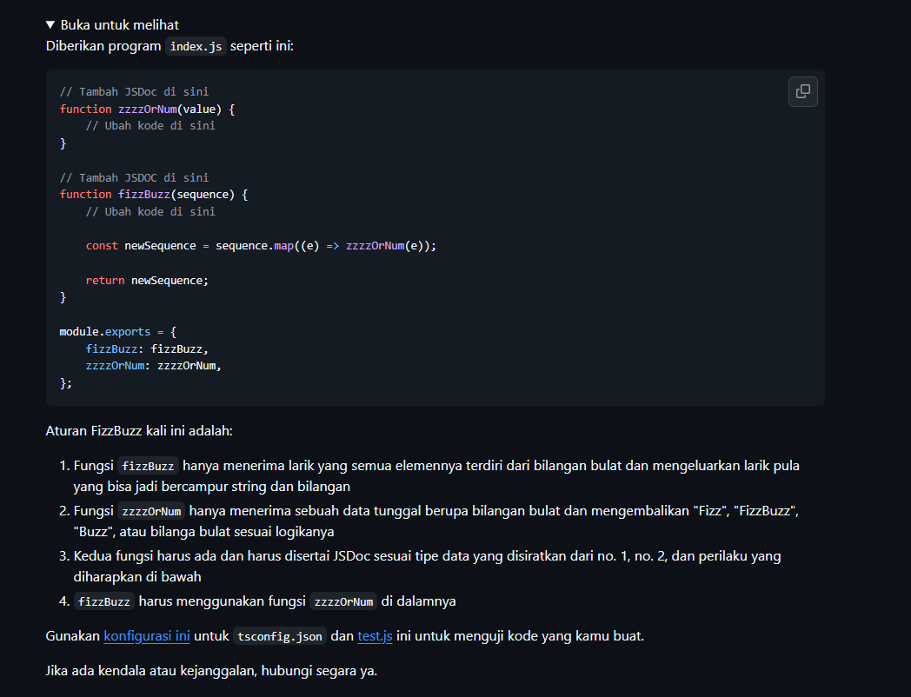
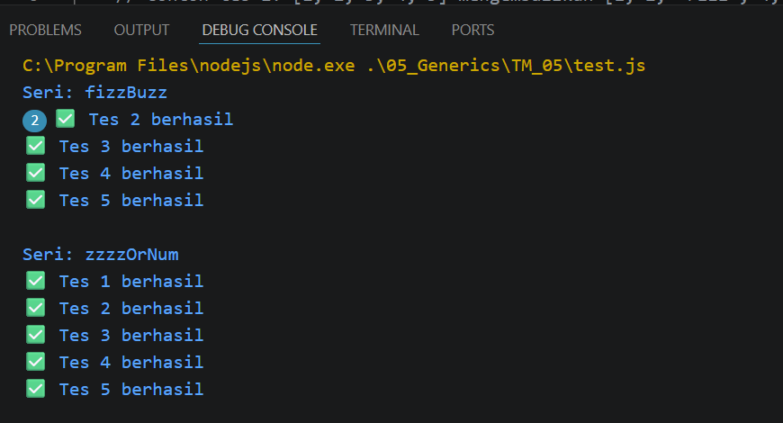

# Tugas Mandiri :  Generics

NAMA : Yensen Lawrenza Simangunsong

NIM  : 103122430054

Kelas: SE-08-02

## Soal

# Program kode 
Tersedia di [fizz.js](../TM_05/fizz.js)
Tersedia di [test.js](../TM_05/test.js)
Tersedia di [tsconfig.json](../TM_05/tsconfig.json)

# Output

# Deksripsi
# penjelasan Fizz.js 

kode pad Fizz.js merupakan implementasi logika FizzBuzz dalam bahasa pemrograman JavaScript yang disusun secara modular dengan validasi data yang cukup ketat. Secara keseluruhan, kode ini terbagi menjadi dua fungsi utama yang saling berkaitan. Fungsi pertama, zzzzOrNum, berfungsi sebagai mesin logika inti yang bertugas mengevaluasi satu angka tunggal untuk menentukan apakah angka tersebut merupakan kelipatan 3 (menghasilkan "Fizz"), kelipatan 5 (menghasilkan "Buzz"), atau kelipatan keduanya (menghasilkan "FizzBuzz"). Keunggulan dari fungsi ini adalah adanya proteksi awal yang memastikan bahwa input harus berupa bilangan bulat, sehingga jika pengguna memasukkan data selain angka bulat, program akan segera memunculkan pesan kesalahan (error).
Fungsi kedua, yaitu fizzBuzz, berperan sebagai pengelola data dalam bentuk larik atau array. Fungsi ini akan menerima sekumpulan angka, memastikan bahwa input tersebut benar-benar sebuah array, lalu melakukan iterasi pada setiap elemennya menggunakan metode .map(). Di dalam proses transformasi ini, setiap elemen array kembali divalidasi agar tetap berupa bilangan bulat sebelum akhirnya diproses oleh fungsi zzzzOrNum. Pada bagian akhir, kode tersebut menggunakan module.exports agar kedua fungsi ini dapat diimpor dan digunakan kembali di dalam file atau modul lain, yang mencerminkan praktik penulisan kode yang bersih dan terorganisir dengan baik untuk pengembangan aplikasi berbasis Node.js.
# penjelasan tsconfig.json

konfigurasi dalm code tsconfig.json berfungsi untuk mengoptimalkan pengecekan kode JavaScript dengan mengaktifkan fitur pelaporan eror melalui checkJs dan memberikan izin kepada compiler untuk memproses file JavaScript melalui allowJs. Dengan mengaktifkan mode strict, aturan pengecekan tipe data menjadi lebih ketat guna menjamin keamanan serta kualitas kode yang lebih baik, sementara opsi noEmit memastikan bahwa compiler hanya berfungsi sebagai alat pengecek kesalahan tanpa menghasilkan file output tambahan. Selain itu, bagian lib menentukan penggunaan pustaka standar ES2015 dan manipulasi DOM agar fitur seperti window atau document dapat dikenali, sedangkan bagian include mengatur agar seluruh file JavaScript di dalam folder proyek secara otomatis masuk dalam cakupan pemeriksaan tersebut.
