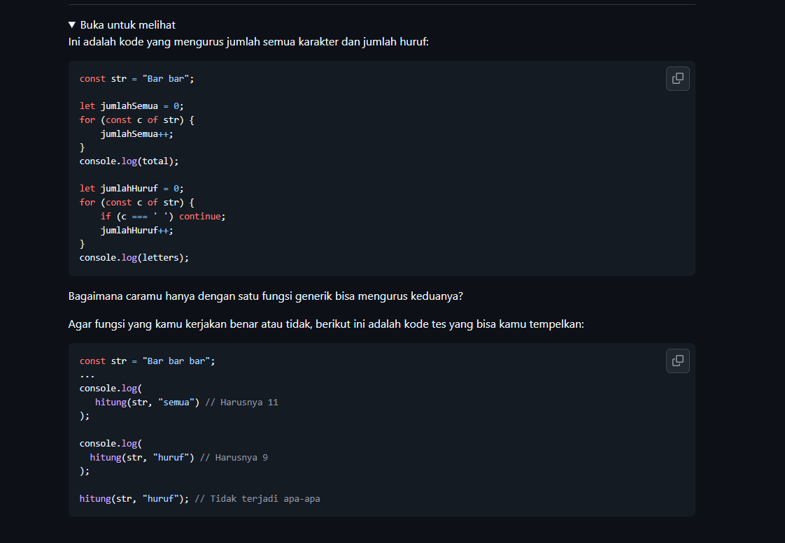
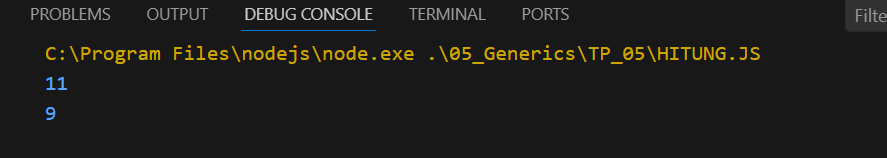

# Tugas Pendahuluam : Generics

NAMA : Yensen Lawrenza Simangunsong

NIM  : 103122430054

Kelas: SE-08-02

## Soal

# Program kode 
Tersedia di [hitung.js](../TP_05/hitung.js)

# Output

Pada bagian contoh, terdapat variabel kata yang berisi teks "Bar bar bar". Ketika fungsi dipanggil dengan parameter "semua", hasil yang diperoleh adalah 11 karena seluruh karakter termasuk spasi dihitung. Sedangkan ketika menggunakan parameter "huruf", hasilnya adalah 9 karena spasi tidak ikut dihitung dan hanya huruf saja yang dihitung.
# Deksripsi

Kode tersebut merupakan sebuah fungsi bernama hitung yang digunakan untuk menghitung jumlah karakter dalam sebuah string sesuai dengan jenis yang dipilih. Fungsi ini memiliki dua parameter, yaitu str sebagai teks yang akan diproses dan tipe sebagai penentu cara perhitungan.

Di dalam fungsi, terdapat variabel hasil yang digunakan untuk menyimpan jumlah karakter. Jika nilai tipe adalah "semua", maka fungsi akan langsung menghitung seluruh karakter pada string menggunakan str.length, sehingga spasi juga ikut dihitung. Namun jika tipe bukan "semua", maka program akan melakukan perulangan untuk mengecek setiap karakter satu per satu. Pada proses ini, hanya karakter yang bukan spasi yang akan dihitung.

Setelah proses perhitungan selesai, nilai yang tersimpan di dalam variabel hasil akan dikembalikan sebagai output dari fungsi.
