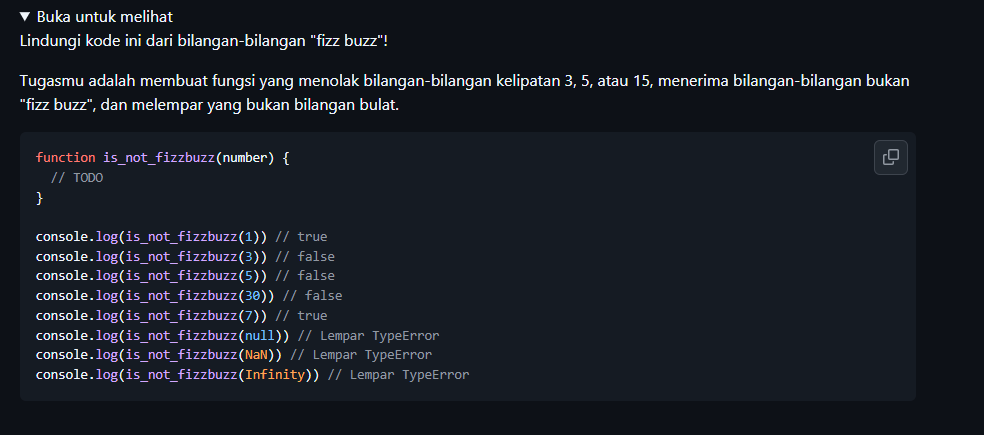
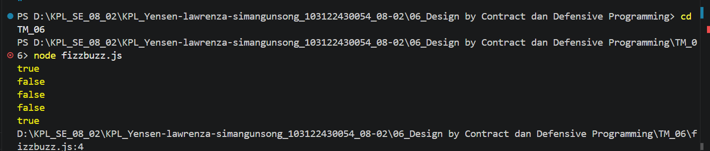

# Tugas Mandiri : Design by Contract dan Defensive Programming

NAMA : Yensen Lawrenza Simangunsong

NIM  : 103122430054

Kelas: SE-08-02

## Soal

# Program kode 
Tersedia di [fizzbuzz.js](../TM_06/fizzbuzz.js)


# Output

# Deksripsi

Fungsi `is_not_fizzbuzz` digunakan untuk mengecek apakah sebuah angka bukan termasuk kategori FizzBuzz.

Cara Kerja nya : 

1. Validasi Input
    Fungsi akan mengecek apakah input yang diberikan benar-benar berupa bilangan bulat (integer).
   Jika input bukan angka, bukan bilangan hingga (finite), atau bukan bilangan bulat, maka fungsi akan menghasilkan error:
     
     TypeError: Input harus bilangan bulat
     

2. Pengecekan FizzBuzz
   Jika angka habis dibagi 3 atau 5, maka angka tersebut termasuk FizzBuzz. Dalam kondisi ini, fungsi akan mengembalikan nilai: false
     

3. Bukan FizzBuzz
   Jika angka tidak habis dibagi 3 maupun 5, maka fungsi akan mengembalikan: true
     

Contoh Penggunaan :

```javascript
console.log(is_not_fizzbuzz(1))   // true (bukan kelipatan 3 atau 5)
console.log(is_not_fizzbuzz(3))   // false (kelipatan 3)
console.log(is_not_fizzbuzz(5))   // false (kelipatan 5)
console.log(is_not_fizzbuzz(30))  // false (kelipatan 3 dan 5)
console.log(is_not_fizzbuzz(7))   // true (bukan kelipatan 3 atau 5)
console.log(is_not_fizzbuzz(null)) // error