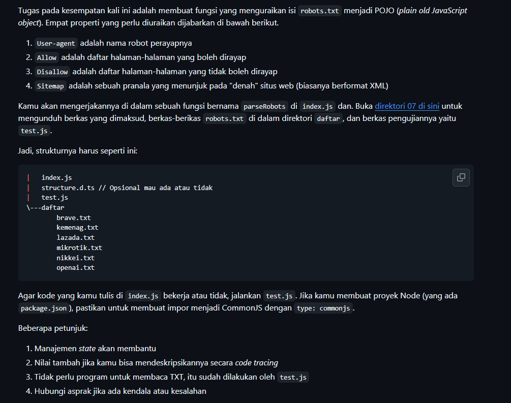
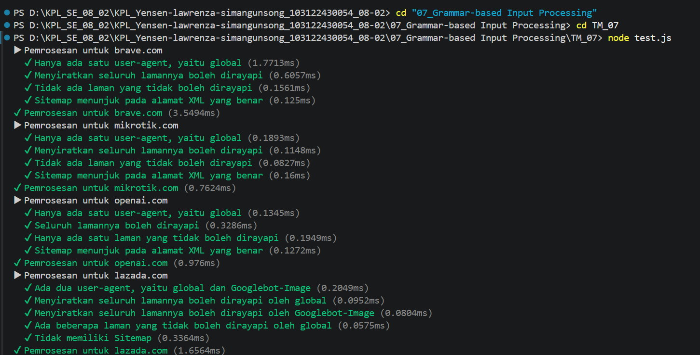
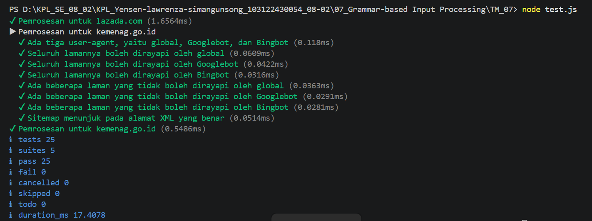

# Tugas Mandiri : Grammar-based Input Processing

NAMA : Yensen Lawrenza Simangunsong

NIM  : 103122430054

Kelas: SE-08-02

## Soal

# Program kode 
Tersedia di [index.js](../TM_07/index.js)

# Output

# Deksripsi
Pengujian ini dilakukan untuk memastikan bahwa program parser robots.txt dapat bekerja dengan baik dalam membaca dan memahami aturan yang terdapat pada file robots.txt dari suatu website.

Berdasarkan hasil eksekusi, program berhasil memproses beberapa website yang diuji, yaitu lazada.com dan kemenag.go.id. Pada pengujian lazada.com, proses parsing berjalan lancar tanpa ditemukan kesalahan, yang menunjukkan bahwa struktur file robots.txt dapat dibaca dengan baik oleh program.

Pada pengujian kemenag.go.id, program berhasil mengidentifikasi tiga user-agent yang digunakan, yaitu global, Googlebot, dan Bingbot. Selain itu, program juga mampu membaca aturan akses halaman, baik yang diizinkan (allow) maupun yang tidak diizinkan (disallow) untuk masing-masing user-agent. Ditemukan bahwa sebagian besar halaman dapat diakses, namun terdapat beberapa halaman tertentu yang dibatasi aksesnya oleh masing-masing crawler.

Program juga berhasil mendeteksi sitemap yang mengarah ke file XML yang valid, yang menandakan bahwa informasi struktur website dapat dikenali dengan benar.

Secara keseluruhan, hasil pengujian menunjukkan bahwa seluruh test yang dijalankan berhasil tanpa kegagalan, dengan total 25 test dan 5 suite. Hal ini menandakan bahwa program parser robots.txt telah berjalan dengan baik, akurat, dan sesuai dengan yang diharapkan.

