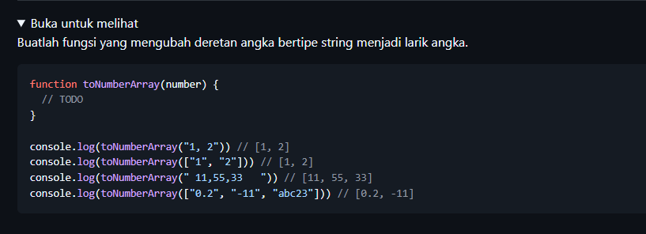
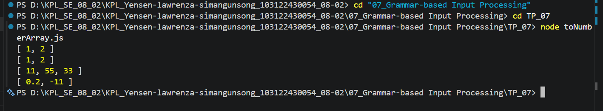

# Tugas Pendahuluam : Grammer-based input Processing

NAMA : Yensen Lawrenza Simangunsong

NIM  : 103122430054

Kelas: SE-08-02

## Soal

# Program kode 
Tersedia di [toNumberArray.js](../TP_07/)

# Output

# Deksripsi

Fungsi toNumberArray dipakai untuk mengubah data yang bentuknya string atau array jadi array berisi angka. Kalau inputnya masih berupa string, misal"1, 2", nanti akan dipisah dulu jadi array berdasarkan tanda koma. nah setelah itu, setiap isi array dicoba diubah jadi angka pakai parseFloat(). Nah, kalau ada data yang ternyata bukan angka (misalnya huruf atau campuran seperti "abc23"), bakal dibuang supaya hasil akhirnya cuma berisi angka yang valid aja. Jadi misalnya masukannya "1, 2" atau ["1", "2"], hasilnya jadi [1, 2]. Tapi kalau ada yang aneh kayak ["0.2", "-11", "abc23"], yang diambil cuma [0.2, -11] karena yang satu lagi bukan angka yang bisa dipakai.