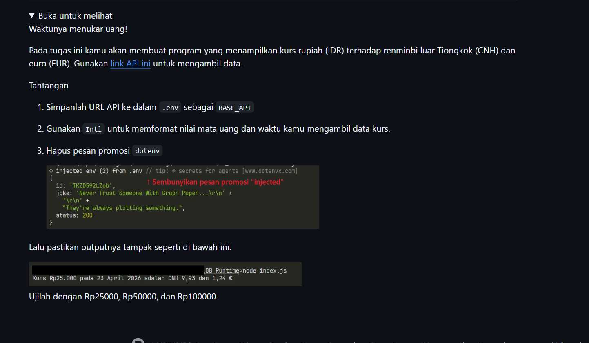
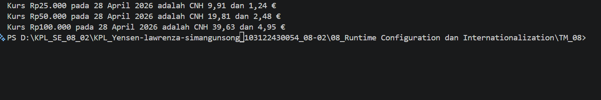

# Tugas Mandiri : Runtime Configuration dan Internationalization
NAMA : Yensen Lawrenza Simangunsong

NIM  : 103122430054

Kelas: SE-08-02

## Soal

# Program kode 
Tersedia di [index.js](../TM_08/index.js)

# Output

# Deksripsi

Program dimulai dengan menyembunyikan pesan promosi dari library dotenv. Library dotenv versi terbaru secara otomatis menampilkan pesan seperti ◇ injected env (1) from .env setiap kali program dijalankan. Untuk menyembunyikannya, fungsi process.stdout.write di-override sebelum dotenv dipanggil, sehingga setiap teks yang mengandung kata "injected env" akan diblokir dan tidak tampil di terminal.

Selanjutnya, program membaca file .env menggunakan require("dotenv").config() yang memuat semua varSiabel ke dalam process.env. Nilai BASE_API kemudian diambil untuk digunakan sebagai URL endpoint API. Program lalu menggunakan fetch() untuk melakukan HTTP GET ke URL tersebut dan mengambil data kurs dalam format JSON.

Untuk memformat tanggal, program menggunakan Intl.DateTimeFormat dengan lokal "id-ID" sehingga tanggal ditampilkan dalam format Indonesia, contohnya "28 April 2026". Untuk memformat angka Rupiah, digunakan Intl.NumberFormat dengan lokal "id-ID" agar pemisah ribuan menggunakan titik, contohnya Rp25.000. Sedangkan untuk nilai CNH dan EUR, digunakan lokal "de-DE" (Jerman) agar pemisah desimal menggunakan koma, contohnya 9,91 — sesuai format yang diminta dalam soal.
Program kemudian menghitung konversi kurs untuk tiga nominal sekaligus yaitu Rp25.000, Rp50.000, dan Rp100.000 dengan mengalikan masing-masing nominal terhadap nilai konversi CNH dan EUR yang didapat dari data API.