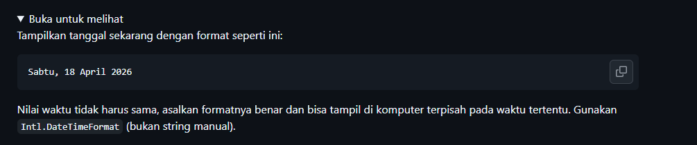
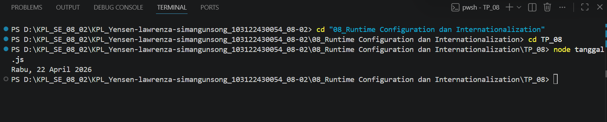

# Tugas Pendahuluam : Runtime Configuration dan Internationalization
NAMA : Yensen Lawrenza Simangunsong

NIM  : 103122430054

Kelas: SE-08-02

## Soal

# Program kode 
Tersedia di [tanggal.js](../TP_08/tanggal.js)

# Output

# Deksripsi

Program ini menampilkan tanggal hari ini dalam format Bahasa Indonesia menggunakan API bawaan JavaScript yaitu Intl.DateTimeFormat, tanpa menggunakan string manual, array nama hari/bulan, atau library tambahan.

Intl.'DateTimeFormat menerima dua argumen: locale dan opsi format. Locale 'id-ID' digunakan agar nama hari dan bulan otomatis tampil dalam Bahasa Indonesia. Opsi weekday: 'long' menghasilkan nama hari lengkap seperti Sabtu atau Rabu, day: 'numeric' menampilkan tanggal tanpa nol di depan, month: 'long' menghasilkan nama bulan lengkap seperti April atau Januari, dan year: 'numeric' menampilkan tahun dalam 4 digit. Nilai waktu tidak harus sama karena new Date() selalu mengambil waktu saat kode dijalankan, sehingga hasilnya otomatis benar di komputer manapun pada waktu apapun.