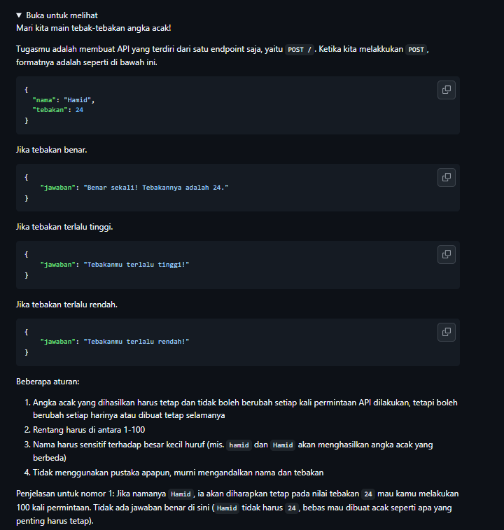
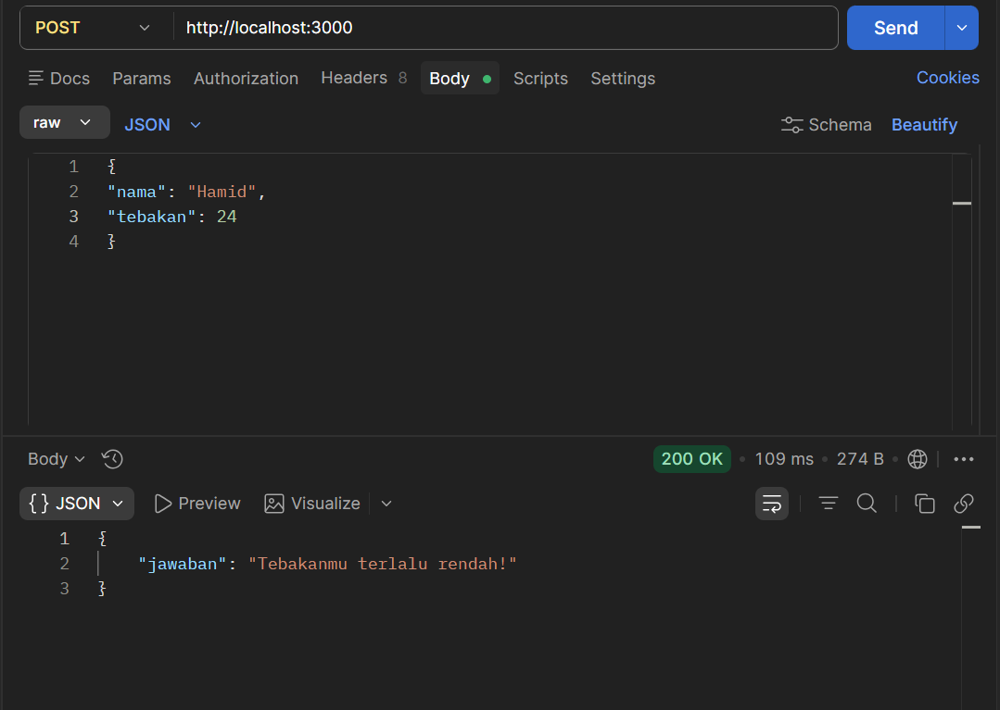

# Tugas Mandiri : API Design dan Construction Using Swagger
NAMA : Yensen Lawrenza Simangunsong

NIM  : 103122430054

Kelas: SE-08-02

## Soal

# Program kode 
Tersedia di [app.js](..//TM_09/app.js)

# Output

# Deksripsi

pada program ini, saya membuat sebuah REST API sederhana menggunakan Express.js di Node.js. Pertama, saya mengimpor library Express dan membuat instance aplikasi menggunakan express(). Selanjutnya, saya menambahkan middleware express.json() agar server dapat membaca request dalam format JSON, karena data yang dikirim oleh pengguna berupa objek JSON yang berisi nama dan angka tebakan.
Saya kemudian membuat fungsi generateNumber yang digunakan untuk menghasilkan angka berdasarkan nama pengguna. Cara kerjanya adalah dengan mengubah setiap karakter dalam nama menjadi nilai ASCII menggunakan charCodeAt(), kemudian menjumlahkan seluruh nilai tersebut. Hasilnya diolah menggunakan operasi modulo 100 dan ditambahkan 1 agar menghasilkan angka dalam rentang 1 sampai 100. Metode ini saya gunakan agar hasilnya bersifat deterministik, yaitu nama yang sama akan selalu menghasilkan angka yang sama, serta tetap memperhatikan perbedaan huruf besar dan kecil (case-sensitive).
Selanjutnya, saya membuat endpoint POST / yang berfungsi untuk menerima input dari pengguna. Pada bagian ini, saya mengambil nilai nama dan tebakan dari body request. Saya juga melakukan validasi untuk memastikan bahwa kedua input tersebut tersedia. Jika input tidak lengkap, maka API akan mengembalikan response dengan status 400 dan pesan error.
Jika input valid, sistem akan memanggil fungsi generateNumber untuk mendapatkan angka yang benar berdasarkan nama. Kemudian, saya membandingkan angka tersebut dengan nilai tebakan yang diberikan pengguna. Jika tebakan sesuai, maka sistem akan mengembalikan pesan bahwa tebakan benar. Jika tebakan lebih besar, maka akan ditampilkan pesan bahwa tebakan terlalu tinggi, dan jika lebih kecil maka akan ditampilkan pesan bahwa tebakan terlalu rendah.
Untuk proses pengujian, saya menggunakan aplikasi Postman. Saya mengirim request dengan metode POST ke endpoint http://localhost:3000/ dengan format body JSON yang berisi nama dan tebakan. Dari hasil pengujian tersebut, API dapat memberikan respon yang sesuai dengan kondisi yang diuji, baik ketika tebakan benar, terlalu tinggi, maupun terlalu rendah. Hal ini menunjukkan bahwa API telah berjalan dengan baik sesuai dengan kebutuhan yang ditentukan.