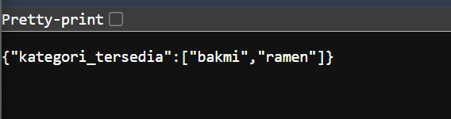

# Tugas Pendahuluam : API Design dan Construction Using Swagger
NAMA : Yensen Lawrenza Simangunsong

NIM  : 103122430054

Kelas: SE-08-02

## Soal

# Program kode 
Tersedia di [index.js](../TP_09/index.js)
Tersedia di [package.json](../TP_09/package.json)

# Output


# Deksripsi
### Penjelasan Kode Program dan Output

Kode program di atas merupakan implementasi sederhana Web API menggunakan Node.js dengan framework Express.js. Pada bagian awal, dilakukan proses import library Express menggunakan `require('express')`, kemudian dibuat instance aplikasi dengan `express()` yang disimpan dalam variabel `app`. Selain itu, ditentukan port yang digunakan oleh server, yaitu port 3000, yang akan menjadi alamat akses API melalui browser.

Selanjutnya, didefinisikan sebuah variabel `menu` yang berisi kumpulan data dalam bentuk array of objects. Setiap objek memiliki atribut `id` dan `nama` yang merepresentasikan nama menu. Pada data tersebut terdapat nilai yang sama, yaitu “bakmi”, yang sengaja digunakan untuk menunjukkan proses penghapusan duplikasi pada tahap berikutnya.

Program kemudian mendefinisikan endpoint root (`/`) menggunakan method `GET`. Endpoint ini berfungsi untuk memberikan respon sederhana berupa teks “API MENU AKTIF ” ketika alamat utama server diakses. Penambahan endpoint ini bertujuan untuk memastikan bahwa server berjalan dengan baik serta menghindari error ketika pengguna mengakses root URL.

Endpoint utama yang dibuat adalah `/menu`, yang juga menggunakan method `GET`. Pada endpoint ini dilakukan proses pengolahan data dengan cara mengambil seluruh nilai `nama` dari array `menu` menggunakan fungsi `map()`. Hasil tersebut kemudian dimasukkan ke dalam struktur data `Set` untuk menghilangkan nilai yang duplikat. Setelah itu, data dikembalikan ke bentuk array menggunakan spread operator (`...`). Hasil akhirnya dikirim sebagai respon dalam format JSON dengan key `kategori_tersedia`.

Pada bagian terakhir, fungsi `app.listen()` digunakan untuk menjalankan server pada port 3000. Ketika server berhasil dijalankan, akan muncul pesan pada terminal yang menunjukkan bahwa server aktif dan dapat diakses melalui alamat `http://localhost:3000`.

### Output Program

Ketika program dijalankan, terdapat dua kemungkinan output berdasarkan endpoint yang diakses. Jika pengguna mengakses root URL (`http://localhost:3000/`), maka akan ditampilkan teks:

```
API MENU AKTIF 
```

Sedangkan jika pengguna mengakses endpoint utama (`http://localhost:3000/menu`), maka akan ditampilkan data dalam format JSON sebagai berikut:

```json
{
  "kategori_tersedia": ["bakmi", "ramen"]
}
```

Output tersebut menunjukkan bahwa sistem berhasil menampilkan daftar kategori menu tanpa adanya duplikasi da
