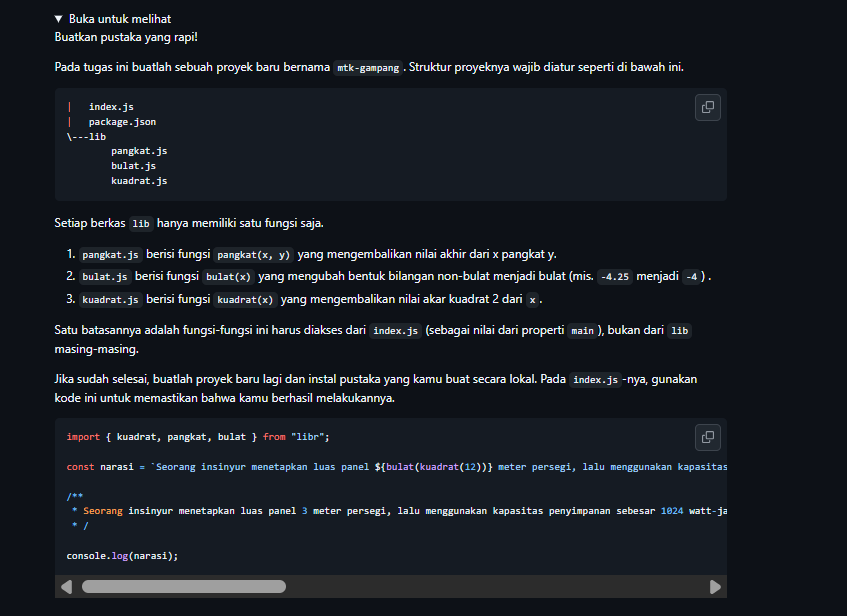
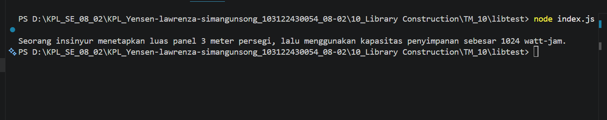

# Tugas Mandiri : Library Construction
NAMA : Yensen Lawrenza Simangunsong

NIM  : 103122430054

Kelas: SE-08-02

## Soal

# Program kode 
Tersedia di [index.js](../TM_10/mtk-gampang/index.js)
Tersedia di [package.json](../TM_10/mtk-gampang/package.json)
Tersedia di [bulat.js](../TM_10/mtk-gampang/lib/bulat.js)
Tersedia di [kuadrat.js](../TM_10/mtk-gampang/lib/kuadrat.js)
Tersedia di [pangkat.js](../TM_10/mtk-gampang/lib/pangkat.js)

# Output

# Deksripsi
Jadi, program ini adalah sebuah library JavaScript sederhana yang aku buat, namanya mtk-gampang. Library ini berisi beberapa fungsi matematika dasar yang aku susun menggunakan konsep ES Module, jadi setiap fungsi aku pisahkan ke file-nya masing-masing di dalam folder lib.
Di library ini ada tiga fungsi utama yang aku buat:

pangkat(x, y) — fungsi ini aku gunakan untuk menghitung hasil perpangkatan dari x terhadap y.
bulat(x) — fungsi ini aku buat untuk membulatkan bilangan desimal ke bilangan bulat terdekat.
kuadrat(x) — fungsi ini aku gunakan untuk menghitung akar kuadrat dari suatu bilangan.

Semua fungsi itu aku ekspor lewat satu file utama, yaitu index.js, supaya pengguna library-ku nggak perlu repot-repot masuk ke folder lib satu per satu — cukup akses dari satu tempat saja.
Selain itu, library ini juga aku dukung dengan instalasi lokal via npm install, jadi bisa langsung dipakai di project JavaScript lain dengan mudah.