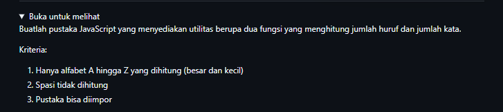
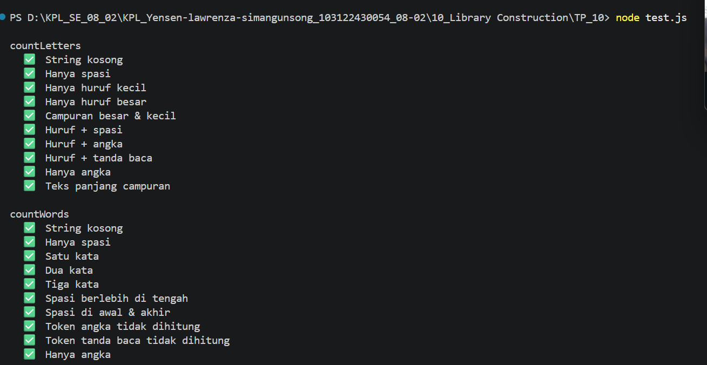

# Tugas Pendahuluam : Library Construction
NAMA : Yensen Lawrenza Simangunsong

NIM  : 103122430054

Kelas: SE-08-02

## Soal

# Program kode 
Tersedia di [index.js](../TP_10/index.js)
Tersedia di [test.js](../TP_10/test.js)

# Output

# Deksripsi
index.js adalah file utama yang berisi pustaka JavaScript dengan dua fungsi utama, yaitu countLetters dan countWords. Fungsi countLetters digunakan untuk menghitung jumlah huruf alfabet A sampai Z dalam sebuah teks, di mana karakter selain huruf seperti angka, spasi, dan tanda baca tidak ikut dihitung. Fungsi countWords digunakan untuk menghitung jumlah kata dalam teks, di mana sebuah token dianggap kata hanya jika mengandung minimal satu huruf alfabet. File ini juga mendukung sistem import menggunakan module.exports sehingga bisa digunakan di file lain.
tets.js adalah file pengujian yang mengimpor kedua fungsi dari index.js menggunakan require. Di dalamnya terdapat 20 test case yang menguji berbagai kondisi, seperti string kosong, hanya spasi, huruf kecil, huruf besar, campuran angka dan tanda baca, hingga teks panjang. Setiap test case menggunakan fungsi assert untuk membandingkan hasil aktual dengan hasil yang diharapkan, lalu menampilkan ✅ jika benar dan ❌ jika salah.
package.json adalah file konfigurasi proyek Node.js yang mendefinisikan nama proyek, versi, deskripsi, file utama, dan script. Dengan adanya package.json, pengujian bisa dijalankan cukup dengan perintah npm test sebagai alternatif dari node tets.js.
Dari output yang dihasilkan, terlihat bahwa seluruh 20 test case berhasil lulus semua tanpa ada yang gagal, yang membuktikan bahwa kedua fungsi pada pustaka berjalan dengan benar sesuai kriteria yang ditentukan.