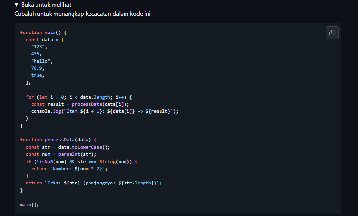
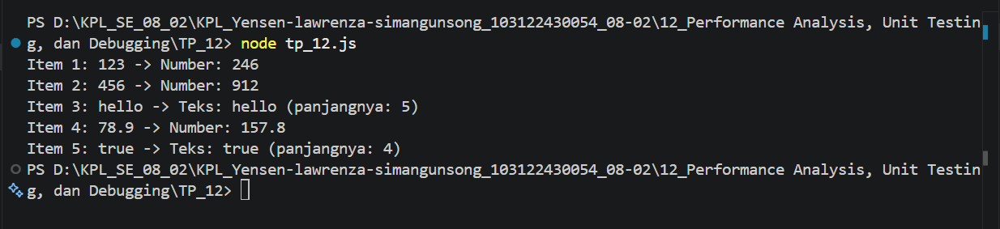

# Tugas Pendahuluam : Performance Analysis, Unit Testing, dan Debugging
NAMA : Yensen Lawrenza Simangunsong

NIM  : 103122430054

Kelas: SE-08-02

## Soal

# Program kode 
Tersedia di [tp_12.js](../TP_12/tp_12.js)

# Output

# Deksripsi
### Analisis Kecacatan pada Kode
Setelah saya membaca dan menjalankan kode yang ada , saya menemukan 2 kecacatan (bug) yang menyebabkan program tidak berjalan dengan benar.

Bug 1 — TypeError pada data.toLowerCase()
Saat saya perhatikan fungsi processData, baris pertama langsung memanggil .toLowerCase() pada parameter data tanpa mengecek tipe datanya terlebih dahulu. Padahal array data di fungsi main berisi campuran tipe data — ada string, number, dan boolean. Method .toLowerCase() hanya bisa dipanggil pada tipe String, sehingga ketika data berupa angka seperti 456 atau 78.9, program langsung crash dengan error:
TypeError: data.toLowerCase is not a function
Untuk memperbaikinya, saya tambahkan String() untuk mengkonversi data ke string terlebih dahulu:
javascript// Sebelum
const str = data.toLowerCase();

// Sesudah
const str = String(data).toLowerCase();

Bug 2 — parseInt memotong angka desimal
Saya juga menemukan masalah pada penggunaan parseInt untuk mendeteksi apakah input adalah angka. Ketika input berupa 78.9, parseInt("78.9") menghasilkan 78 karena bagian desimalnya dipotong. Akibatnya, kondisi pengecekan str === String(num) menjadi "78.9" === "78" yang bernilai false, sehingga 78.9 tidak dikenali sebagai angka dan salah masuk ke cabang Teks.
Saya perbaiki dengan mengganti parseInt menjadi parseFloat agar angka desimal tetap bisa terdeteksi:
javascript// Sebelum
const num = parseInt(str);

// Sesudah
const num = parseFloat(str);

Output Setelah Diperbaiki
Setelah kedua bug diperbaiki, program berhasil dijalankan dan menghasilkan output yang sesuai:

Item 1: 123 -> Number: 246

Item 2: 456 -> Number: 912

Item 3: hello -> Teks: hello (panjangnya: 5)

Item 4: 78.9 -> Number: 157.8

Item 5: true -> Teks: true (panjangnya: 4)